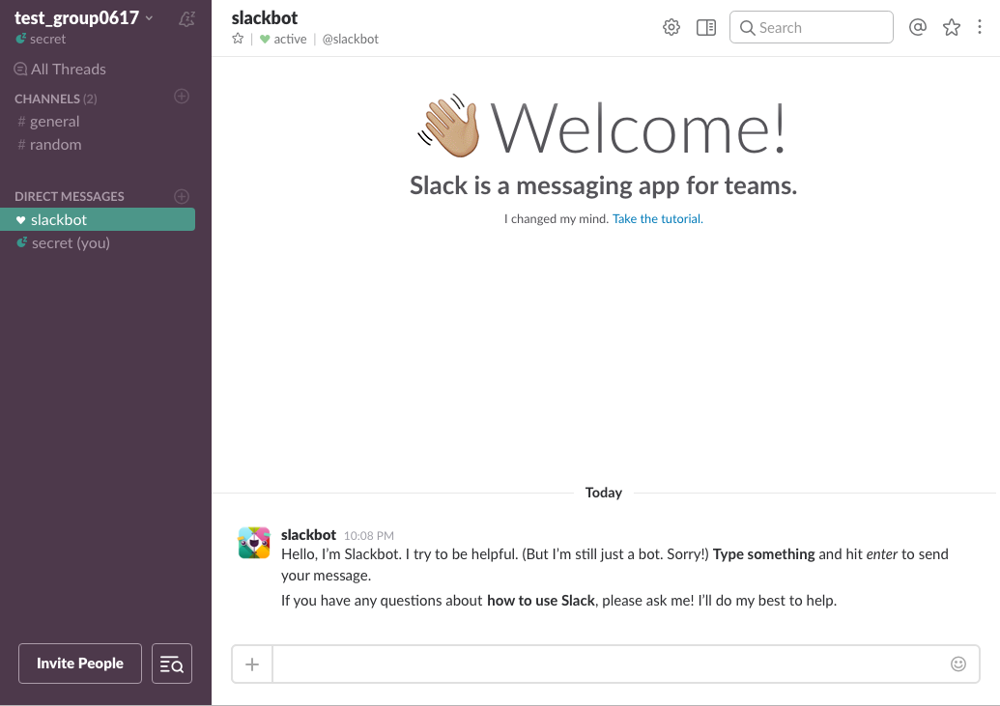

# 슬랙을 사용해봅시다

주로 IT기업과 스타트업에서 많이 사용하는 기업용 메신저입니다.   
단톡방과 유사한 **'채널'**을 만들고 각 채널에 멤버들을 초청해서 대화를 시작할 수 있습니다. 

주로 팀별/프로젝트별로 채널을 만들고, 그에 관련한 대화를 나눕니다. 

#### 커뮤니케이션을 빨리 할 수 있습니다. 

#### 모바일 알림기능이 세분화되어있어서 원하는 내용만 push받을 수 있습니다. 
>1) 해당 채널의 모든 내용  
2) 나의 아이디를 언급할 경우 (예시: @secret:보고 답장주세요)   
3) 사전에 지정해둔 중요 단어(예:보안)를 언급할 경우   
4) 1:1 메시지인 경우   
5) 알림 끔  

#### 데스크탑에서도 대화나, 파일 검색이 가능해 정보 공유가 간단합니다. 
>메신저나 이메일을 이용해 검색하는 것 보다 빠르고 쉽게, 공유한 파일을 다시 찾을 수 있고, 파일에 대한 별도의 커뮤니케이션도 가능합니다. 

#### 구글드라이브, github등 업무용 솔루션과 연계가 잘 되어있어서 쉽게 데이터를 가져오고 슬랙으로 알림을 받을 수 있습니다. 

 

## 슬랙 협업 공간을 만들어봅시다. 

**슬랙 홈페이지(http://slack.com/) 첫 화면에서 이메일 주소를 적고 `get started`를 클릭합니다.**

**start with a team이라는 화면이 뜨면,  
기존에 있던 팀에 들어갈건지, 새로운 팀을 만들 건지 물어보면 상황에 맞는 선택을 하면 됩니다.**
 

>####`Join an existing team(기존 팀에 들어가기)`
>
>

>#### `Create a new team(새로운 팀 만들기)`  

> - Check your email 화면이 뜨고, 메일로 보낸 본인 확인 코드를 적어줍니다.
> 

> - What's your name? 화면이 뜨면 이름와 유저네임을 적고, 
> 
 
> - `Continue to Password` 로그인 할 때 필요한 password를 설정해줍니다. 
> 
 
> - `Continue to Team Info`을 눌러 팀에대한 정보를 입력하고 
> 
 
> - `Continue to Team Name`을 눌러 팀 이름을 정해줍니다. 
> 

> - `Continue to Team URL`을 눌러 팀에 사용할 url을 정해줍니다. 
> 
 
> - `Create Team`을 누르고, `I Agree`를 누르면 팀 생성이 끝납니다.
> 

>  - 팀원들의 Email address를 적고 `Send Invitations`를 눌러 초대합니다. 
> 

**슬랙이 생성되었습니다.**  

슬랙은 단일 계정이 아니라 복수의 이메일 계정을 활용할 수 있고, 하나의 이메일 계정으로 여러 팀에 참여할 수 있습니다. 

  

## 메시지를 사용해봅니다. 
사람들과 대화하기 위해, 주제에 맞는 채널로 들어가 입력창에 대화할 내용을 입력합니다. 채널은 일종의 단톡방이라고 생각하시면 됩니다. 
처음 팀이 만들어지면 기본으로 제너럴(general)과 랜덤(random)이 준비됩니다. 

내가 지금 보고있는 채널을 확인하려면 채팅창의 상단에 노출된 `#채널명`을 확인합니다. 

#### 공개 메시지
공개 메시지는 같은 채널에 있는 모든 사람이 볼 수 있습니다.
공개 메시지를 보낼 때, 특정한 사람을 언급하려면 `@상대방닉네임`을 입력하면 됩니다. 

#### 개인 메시지 (direct messages)
특정한 사람과 개인적으로 따로 이야기하고싶을 땐 `DM`을 보낼 수 있습니다. 

#### 리액션(Reaction)
스티커와 이모티콘을 이용할 수 있습니다. 다양한 감정을 표현할 수 있고, 직접 만든 이미지 파일을 이용하여 리액션 아이템으로 등록하고 사용할 수 있습니다.  

#### 스니펫(Snippet)
작성한 코드나 회의록 등을 텍스트 기반으로 공유하는 데 유용한 기능입니다. 자주 사용하는 코드를 저장하고 필요할 때마다 쉽게 꺼내서 사용할 수 있는 기능을 말합니다. 

>입력창의 `+`를 눌러 `Code or text snippet`을 선택하고,
>
>
>코드나, 텍스트를 입력합니다. 프로그래밍 언어를 선택할 수도 있습니다. 
>
>
>

#### 마크다운(Markdown)
콘텐츠의 길이가 짧거나 특정한 부분을 공유하거나 강조하고 싶을 때에는 마크다운 기능을 사용하면 좋습니다. 
메세지를 입력하기 시작하면 하단에 안내가 나오므로 참고해서 쓰면 됩니다. 

 

## 채널(Channel)
기존의 메시징이나 이메일 등은 불필요한 정보까지 마구 들어오기 때문에, 필요한 정보를 선별하기가 쉽지 않았습니다.   
슬랙은 이런 불편을 해결할 수 있는 방안으로 채널을 이용합니다. 
기본적으로 팀이 생성되면 #general과 #random 두 개가 생기는데, 필요에 따라 채널을 만들 수 있습니다.

소규모 팀이라면 기본 채널로 모든 의사소통과 정보 공유를 해도 무방하지만, 정보 소통의 분류와 권한 관리가 필요하다면 채널을 적극 활용하는것이 좋습니다.  

[슬랙과 다른 프로그램 연동하기](http://ljs93kr.tistory.com/7)
