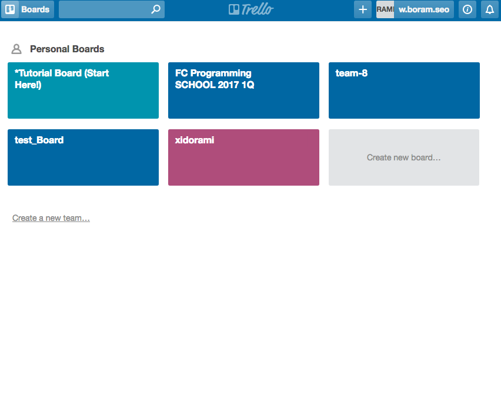
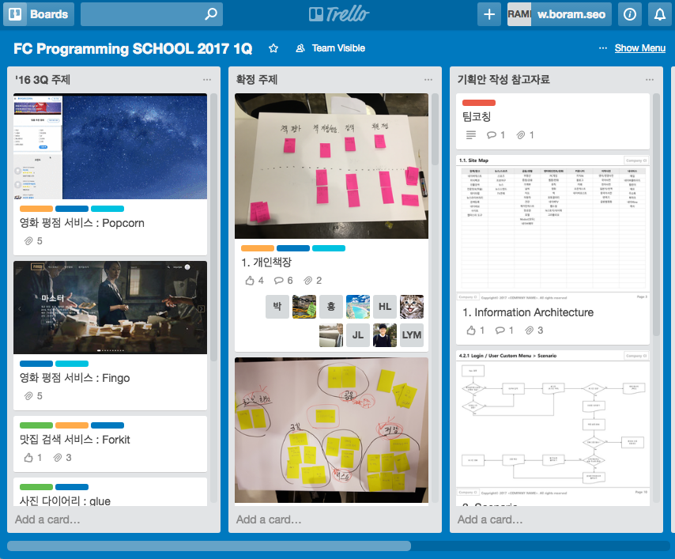
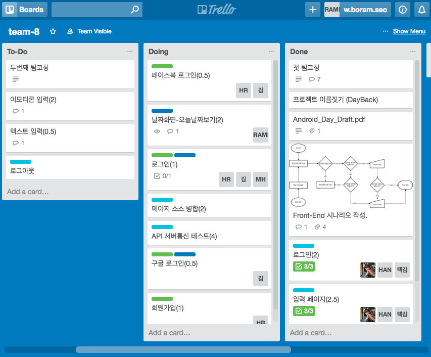
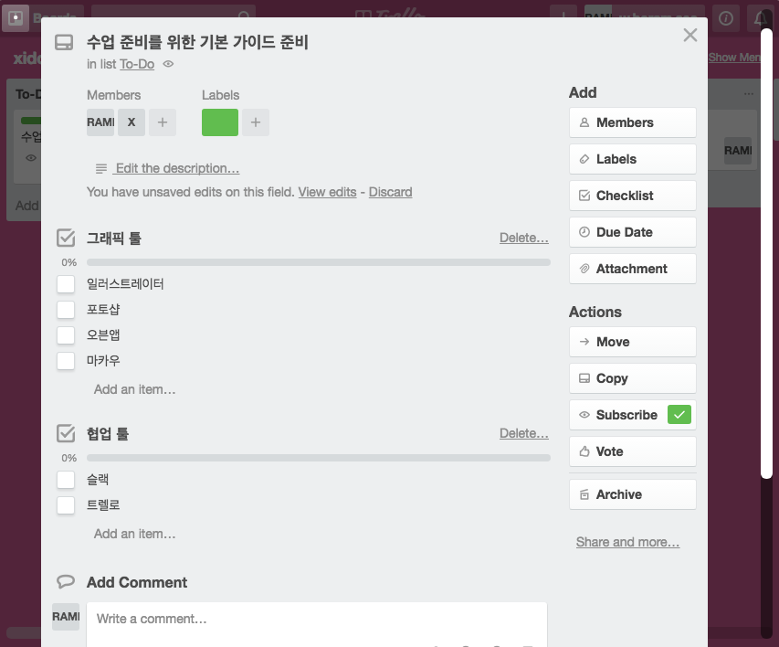

# 트렐로를 사용해봅시다 
일정관리를 효율적으로 하기 위한 서비스입니다. 주제에 따라 각각의 내용을 Board로 나눠서 관리할 수 있습니다.  

사람들의 작업 진척 정도를 실시간으로 한 눈에 볼 수 있고, 나만의 보드를 사용할 수도 있습니다.   
프로젝트를 수정했을때 자동으로 activity로그가 남아, 다른 사람이 전에 무엇을 했는지 파악하기 용이합니다. 

[트렐로 홈페이지](https://trello.com/)로 들어가서 가입할 수 있는데, 구글 아이디로 연동해서 사용하면 편합니다.  
슬랙이나 구글 캘린더 등의 프로그램과 연결해서 쓸 수 있습니다.

 

프로젝트별로, 여러가지 보드를 만들어서 사용할 수 있습니다. 

 

보드는 다양한 방법으로 사용할 수 있습니다.  
여러가지 리스트들을 만들고, 리스트마다 카드들을 채우고, 카드의 내용들을 멤버들과 함께 보며 관리할 수 있습니다. 

>리스트 사용 예시 중 하나입니다.   
>**To-Do :** 앞으로 해야 할 일들을 적어둡니다.    
>**Doing :** 진행중인 작업이 Doing카드리스트로 옮겨집니다.      
>**Done :** 완료된 작업을 옮겨둡니다. 기록할 필요가 없을땐 삭제합니다.  
>**Issues :** 현재 보드의 주제에서 생기는 문제들을 기록합니다.  

 

카드는, 내용을 적어두는 것은 기본이고, 오른쪽의 메뉴를 이용해 여러 가지를 할 수 있습니다.   

작업에 대한 담당 **멤버를 표시**할수도 있고,   
**라벨**을 이용해 팀별로 분류도 가능합니다.    
**체크 리스트**를 만들어서 진행 상황에 대해 확인하거나,    
**투표**를 할 수도 있고, **관련 자료를 연동**하는 등 다양하게 사용할 수 있습니다. 

[트렐로 초급 사용설명서](https://trello.com/b/UTc6X4FS/-)를 이용해 사용법을 익혀보세요 
